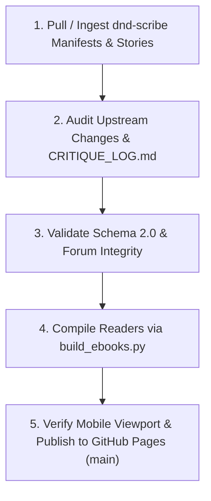

---
name: scribe-sync-editor
description: Ingest, audit, verify, and publish upstream dnd-scribe PR merges, editorial forum updates, and Schema 2.0 interactive eBook readers.
---

# 📚 Scribe Sync & Interactive EBook Editorial Skill

Use this skill when auditing merged PRs from `dnd-scribe`, validating Schema 2.0 manifests, synchronizing the editorial forum & retcon watchlist, and compiling production eBook readers for `dndwikis`.

---

## 🏛️ The 5-Stage Editorial & Engineering Protocol



---

## 📋 Operational Steps

### 1. Ingest & Diff Upstream Assets
Inspect newly merged changes from `d:\Code\dnd-scribe`:
- Manifests: `sessions/data/index/sN-manifest-v2.json`
- Story files: `sessions/data/clean/sN-clean-story.md`
- Critique Log: `sessions/data/critiques/CRITIQUE_LOG.md`

### 2. Editorial Audit Checklist
Verify that the upstream agent respected the reader's directives:
- [ ] Were all `[APPLIED]` items from `CRITIQUE_LOG.md` properly integrated into story blocks?
- [ ] Are deferred items logged in `editorialForum.retconWatchlist`?
- [ ] Is the PR revision summarized in `editorialForum.changelog`?
- [ ] Does the lead bot critic grade match prose updates?

### 3. Engineering Compilation Gate
Compile all session editions:
```powershell
python build_ebooks.py
```
Verify:
- [ ] Zero build warnings or syntax errors.
- [ ] Bot GitHub App private key loaded and base64-encoded cleanly.
- [ ] Rotten Tomatoes 🍅 critic badge reflects manifest `bot_grade`.
- [ ] Chapter breadcrumbs correctly interpolate Light Green -> Cyan Green on completion.

### 4. Verification & Publish
Check git diff and push directly to `origin main`:
```powershell
git add -A
git commit -m "feat(sync): publish upstream scribe PR updates and refreshed editorial forum"
git push origin main
```
